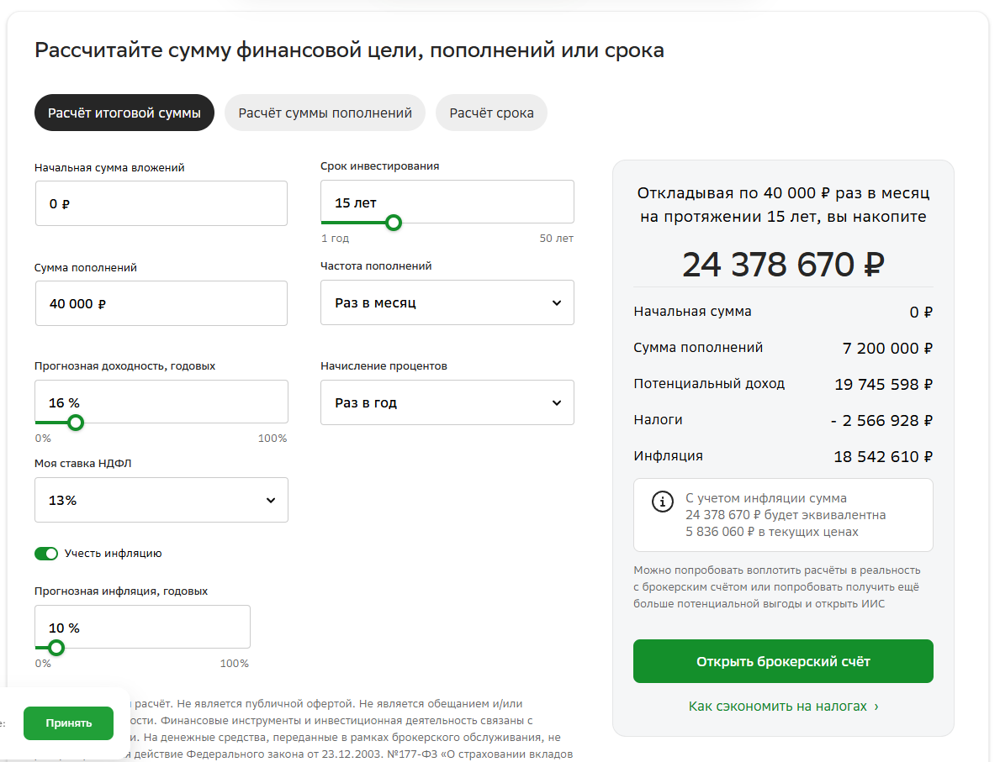
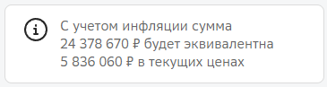
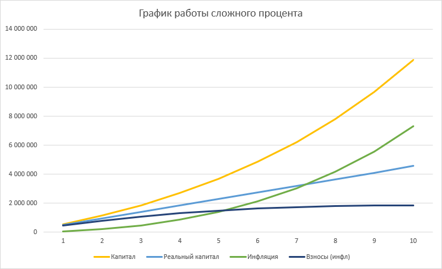
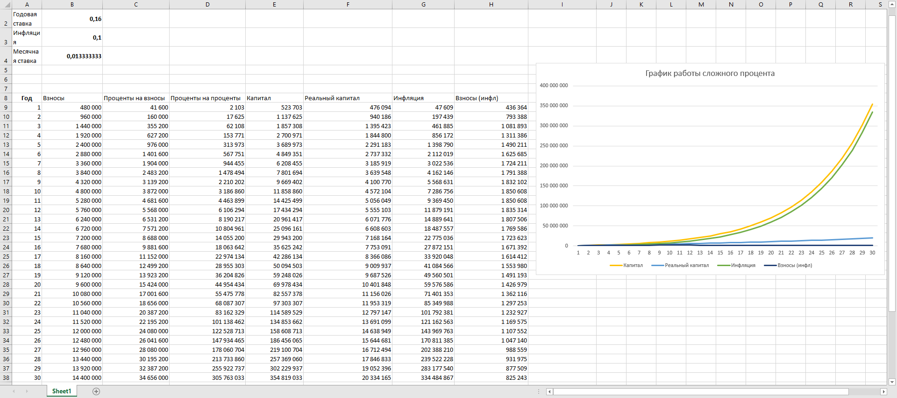

### Сложный процент

Сложный процент - причисление процентов к сумме вклада, их реинвестиция в рынок.

Грубо говоря, все деньги

#### Что такое зачем надо

На этом феномене математики основана стратегия инвестирования

Суть стратегии - инвестировать на очень долгий (20-30 лет) срок с реинвестиций доходов обратно в рынок.

На Ютуб достаточно много роликов, зачастую ~~инфоцыганских~~ мотивирующих им пользоваться

#### Почему это круто

Если открыть любой доступный калькулятор сложного процента, то можно увидеть, что за терпение и постепенное внесение капитала на инвестиционный счет сложный процент подарит нам огромные богатства

Как можно видеть, через 15 лет внесения 40к ежемесячно сложный процент принесет нам 24.4 миллиона, из которых 7.2 - наши вложения

Но если мы взглянем ниже, то..

Получается мы даже не уберегли свои 7.2 от инфляции? Нет, просто вложить 40к в начале срока инвестирования и в конце - абсолютно разные вещи.

Через 15 лет 40к достать из своего кармана будет куда проще

#### Где зарыт процент

Главный подвох в том, что редко можно проследить за инфляцией на таких калькуляторах

Я составил таблицу в excel, где наглядно показывается работа инфляции и сложного процента

Параметры инвестирования те же

Ежемесячный взнос - 40к
Годовая ставка - 16%
Инфляция - 10%

- Капитал - Итоговая сумма, которую мы увидим через 15 лет (на бумаге, естественно)
- Реальный капитал - Капитал с учетом инфляции
- Инфляция - Разность итоговой суммы и реального капитала
- Взносы (инфл) - Взносы с поправкой на инфляцию

Подробнее остановлюсь на взносах и расчетах инфляции.

Взносы всегда равны 40к в месяц, но график показывает их актуальную ценность. 

**Пример** - Прямо сейчас 40к стоят ровно 40к. Через год эта же сумма будет равна $$40 - (40*10\%) = 36$$

Наши 40 тысяч рублей за год обесценились до 36. Именно обесценивание наших взносов и показывает этот график.

Реальный капитал же расчитывался по формуле $$S/(1+I)^Y$$ 

Где 
_S_ - Итоговая сумма на конец года
_I_ - Коэффициент инфляции
_Y_ - Год с начала инвестирования

##### Описание графика

Как можно видеть, инфляция вполне спокойно догоняет наши доходы и одной экспонентой мы боремся с другой.

Главный плюс сложного процента - не золотые горы, а сохранение капитала.

Как можно видеть, наши взносы после 5 года начали падать в цене, а реальный капитал стабильно рос и не сильно терял в ценности.

##### Дополнительный пример

Здесь в ультра-мега-4k качестве скрин с расчетами на 30 лет. Файл представлен в репо, так что можете потыкать сами

Главное, что хотел показать, что ситуация с годами сильно не меняется

Реальный фактор, который влияет на доходность - реальный процент, т.е. $$процентДоходности - процентИнфляции$$

Подробнее [тут](https://ru.wikipedia.org/wiki/Уравнение_Фишера)

В нашем примере это 6% годовых, что не так уж и много
