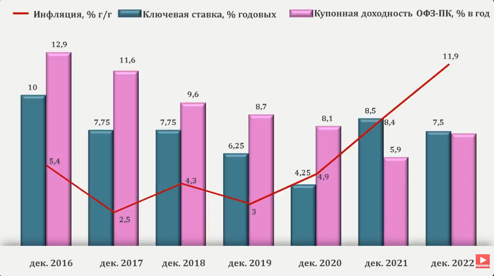
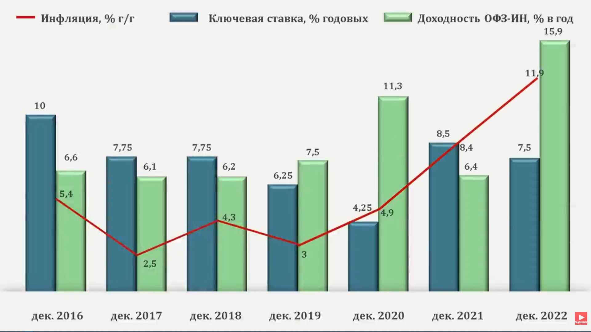

## Облигации Федерального Займа

[источник](https://www.youtube.com/watch?v=czehbTLcC-8)

Это вид облигаций, где эмитентом выступает государство, Россия.
Государство выпускает несколько типов облигаций:
- **ОФЗ-ПД** - облигации с постоянным доходом
- **ОФЗ-ПК** - облигации с переменным купоном. Зависит от RUONIA
- **ОФЗ-ИН** - облигации с индексируемым номиналом. Купонная доходность низкая, но номинал растет в зависимости от индекса потребительских цен
- **ОФЗ-АД** - облигации с амортизацией долга

Как правило, цена и доходность ОФЗ зависит от ставки ЦБ. При повышении ставки, цена падает, доходность растет. При понижении цена растет, а доходность падает. Больше всего этому правилу подвержены ОФЗ-ПК.

Торги по ОФЗ-ПД происходят, как правило, ниже номинала. У ОФЗ-ПК торги стремятся к номиналу, но чаще выше него

ОФЗ-ИН зависит от индекса потребительских цен. Инфляция опирается на этот индекс, а как мы знаем, инфляция растет всегда. Соответственно индекс тоже всегда растет, растет и номинал. 
При этом у ОФЗ-ИН есть зависимость от ставки ЦБ. Чем выше ставка, тем дешевле такие облигации и наоборот. 

#### Зачем созданы

**ОФЗ-ПК** созданы, чтобы застраховать инвесторов от изменения ключевой ставки. Но от инфляции могут не спасти. Разберем выпуски ОФЗ-ПК с 2016 по 2022 года.

Пока ключевая ставка ЦБ была выше гораздо инфляции доходность была высокой. Как только инфляция обогнала ставку ЦБ, то доходность резко упала, не спасая вложения от этой самой инфляции.

Соответственно ОФЗ-ПК могут быть интересны, <u>когда ставка ЦБ значительно превышает темпы роста инфляции.</u> При этом надо помнить, что они торгуются значительно выше номинала и нужно их покупать, когда цена близка к нему/ниже него.

**ОФЗ-ИН** созданы, чтобы сохранять вложения от инфляции. Выгодны, когда инфляция значительно выше ставки ЦБ. Посмотрим на графики

При росте инфляции с небольшой задержкой доходность выросла, спасая капитал от этой инфляции.
